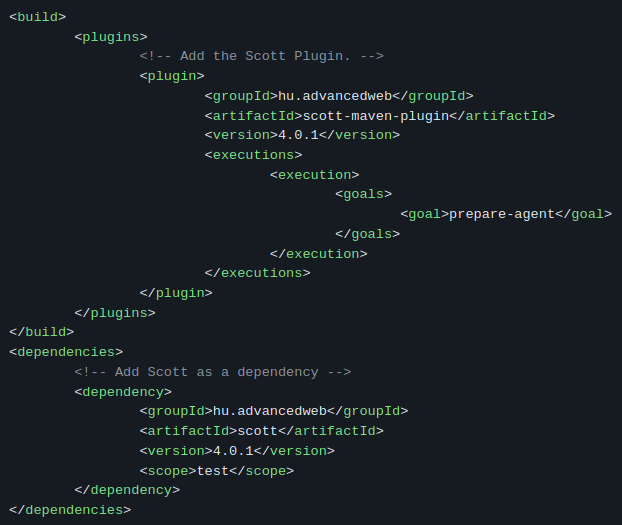

<h1 align="center">Tutorial : Continuous integration, static analysis and test automation</h1>
<h4 align="center">Axel Allain</h4>

---
<div style='text-align: justify;'>
Dans le paysage du développement logiciel moderne, les pratiques telles que l'intégration continue, l'analyse statique et l'automatisation des tests jouent un rôle crucial pour garantir la qualité, la fiabilité et l'efficacité des logiciels. Ces trois concepts, bien que distincts, convergent vers un objectif commun : améliorer le processus de développement et la qualité du code.éveloppement et réduit les risques liés aux modifications.
  
En combinant l'intégration continue, l'analyse statique et l'automatisation des tests, les équipes de développement peuvent créer un environnement robuste et agile qui favorise la livraison rapide de logiciels de haute qualité, répondant ainsi aux besoins changeants des utilisateurs dans un monde en évolution constante de la technologie.

Nous avons ici essayé d'implémenter des outils autour de ces 3 sujets.

## Outils
- Scott Test reporter
- Pitest
- Jenkins
- Dspot

## Scott Test reporter 📰

Scott est un outil conçu pour faciliter les tests unitaires dans les environnements Java. En effet, Scott offre une interface claire et concise pour visualiser les résultats des tests. Son intégration avec JUnit en fait un choix populaire parmi les développeurs Java, offrant des fonctionnalités avancées telles que la génération de rapports détaillés et la prise en charge de divers formats de sortie.   


### Etapes de mise en place :

1.  **Environnement du Projet**  
Pour utiliser Scott, il faut dans un premier temps mettre en place un projet Java utilisant Maven ou Gradle. Sur le projet Doodle, j'ai opté pour Maven pour gérer les dépendances de mon projet car de nombreux outils que j'ai utilisé plus tard sont basés sur cet outil.

2. **Ajouter les dépendences**   
L'implémentation de Scott passe par l'ajout des dépendences de Scott dans le pom.xml du projet.  

  
⛔ Dans mon implémentation, j'avais oublié d'ajouter les dépendances de JUnit qui sont primordiales pour Scott et pour réaliser des tests unitaires pour le projet Doodle.  
```
<dependency>
	<groupId>io.quarkus</groupId>
	<artifactId>quarkus-junit5</artifactId>
	<scope>test</scope>
</dependency>
```

3. **Configuration**   
Il est aussi possible de configurer Scott directement dans le pom.xml ```ScottReportingRule``` pour capturer uniquement certains cas de test avec des annotations rentrées aux préalables. 

4. **Récupération des rapports** 
Pour récupérer les rapports de Scott, il faut build le projet avec les dépendences ajoutées précédemment. On obtient dans le dossier target ou directement dans la console les détails sur nos cas de test.

### Conclusion Scott
Dans l'écosystème DevOps, Scott fournit des rapports détaillés sur les tests unitaires et permet aux équipes DevOps de détecter rapidement les défauts de code et de les corriger avant qu'ils ne progressent dans le processus de déploiement. Ainsi, Scott contribue à accélérer la livraison des logiciels tout en maintenant leur fiabilité et leur stabilité.

## Pitest 🤖  
Pitest est un outil de mutation testing conçu pour élever la qualité des tests dans les environnements Java. En introduisant des mutations contrôlées dans le code source, Pitest évalue la robustesse des suites de tests en mesurant leur capacité à détecter ces mutations.

### Etapes de mise en place :

1.  **Environnement du Projet**  
Pour utiliser Pitest, nous restons dans notre environnement Maven que nous mis en place précédemment.

2. **Ajouter les dépendences**   
L'implémentation de Pitest passe par l'ajout des dépendences de Pitest dans le pom.xml du projet.  

⛔ Ci-dessous, ma dépendance utilise constamment la dernière version de Pitest ce qui n'est pas forcément un bonne pratique. Les dernières versions développés d'une librairie doivent être testées par l'équipe de développement.
```
<plugin>
    <groupId>org.pitest</groupId>
    <artifactId>pitest-maven</artifactId>
    <version>LATEST</version>
</plugin>
```

4. **Récupération des rapports** 
Pour récupérer les rapports Pitest, il faut éxécuter la commande suivante : ```mvn test-compile org.pitest:pitest-maven:mutationCoverage```   
Un exemple de rapport Pitest :  
  
Ici, on peut voir les zones rouges où les mutants n'ont pas survécu correspondant aux zones pas assez testées et les zones vertes où les mutants ont été tué.  

### Conclusion Pitest
Dans le contexte du DevOps, Pitest renforce la qualité des tests automatisés. En identifiant les zones de faiblesse des suites de tests, il permet aux équipes DevOps d'améliorer la robustesse de leur code. En intégrant Pitest, les équipes de développement peuvent détecter les défauts de manière proactive tout au long du cycle de développement. Cette approche renforce la confiance dans les déploiements automatisés, accélérant ainsi la livraison continue tout en réduisant les risques d'incidents en production.

## Dspot 🧪  
Dspot peut être un très bon outil dans le domaine du test logiciel automatisé. En tant qu'outil de génération automatique de cas de test pour les programmes Java, Dspot change la façon dont les développeurs font de la validation et de la vérification de leur code. Dspot va identifier les zones critiques du code nécessitant une meilleure couverture de test pour produire des cas de test plus efficaces.

### Etapes de mise en place :

1.  **Jenkins**  
Dspot étant un plugin, j'ai décidé de l'utiliser avec Jenkins, un outil d'intégration continu visuel pour tester et déployer une application. Il faut donc déployer un serveur local Jenkins et ajouter le plugin lors de la configuration.  

 

⛔ Le serveur Jenkins doit être relié à notre projet Maven et intégrer la bonne version de Java. Un mauvais chemin vers le projet va faire échouer les builds et une mauvaise version de Java dans Jenkins va créer des conflits lors de la compilation du code.

Nous pouvons maintenant lancer des builds de façon beaucoup plus simple.

2. **Récupération des rapports Dspot** 
Après avoir amplifié nos tests et ajouté des cas de test, Dspot va afficher dans la console des informations sur ce qu'il a produit.  
```
Initial instruction coverage: 30 / 34
88.24%
Amplification results with 5 amplified tests.
Amplified instruction coverage: 34 / 34
100.00%
```

### Conclusion Dspot
En automatisant la génération de cas de test pour les programmes Java. Les équipes DevOps peuvent accélérer la validation du code tout en améliorant sa qualité. En identifiant automatiquement les zones à risque et en produisant des tests pertinents, Dspot permet une couverture de test plus complète, réduisant ainsi les régressions. Cela favorise une culture DevOps axée sur l'automatisation, la collaboration et la livraison plus rapide.

## Conclusion Générale  
La mise en place des outils de Continuous Integration (CI), d'analyse statique et d'automatisation des tests constitue une étape importante dans l'amélioration du processus de développement logiciel. Tout au long de ce tutoriel, nous avons exploré différentes solutions telles que Scott Test reporter, Pitest et Dspot, chacune apportant sa contribution à l'objectif d'assurer la qualité, la fiabilité et l'efficacité des logiciels.

Scott Test reporter offre une visibilité claire sur les résultats des tests unitaires, permettant aux équipes de développement de détecter rapidement les défauts de code et de les corriger avant qu'ils ne progressent dans le processus de déploiement. Pitest, quant à lui, renforce la qualité des tests automatisés en identifiant les zones de faiblesse des suites de tests, ce qui permet d'améliorer la robustesse du code. Enfin, Dspot automatise la génération de cas de test pour les programmes Java, accélérant ainsi la validation du code et améliorant sa qualité en identifiant automatiquement les zones à risque et en produisant des tests pertinents.

En conclusion, en combinant ces outils au sein d'un environnement DevOps, les équipes DevOps peuvent créer un processus agile favorisant la livraison rapide de logiciels de haute qualité. Cette approche contribue à réduire les risques liés aux modifications, à renforcer la confiance dans les déploiements automatisés et à répondre aux besoins  des utilisateurs.


</div>
