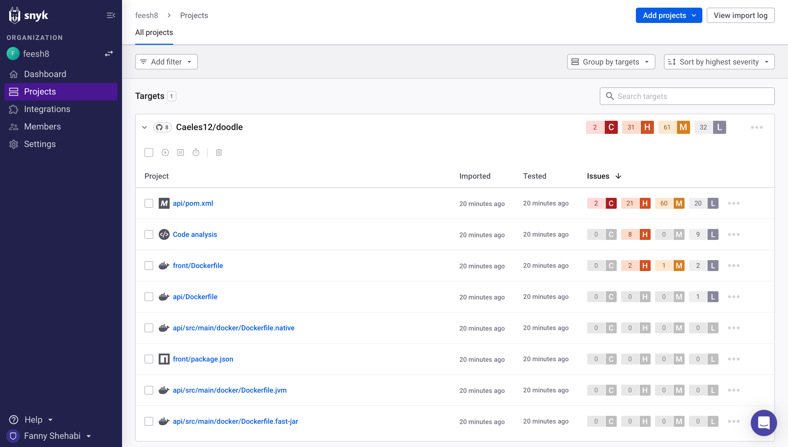
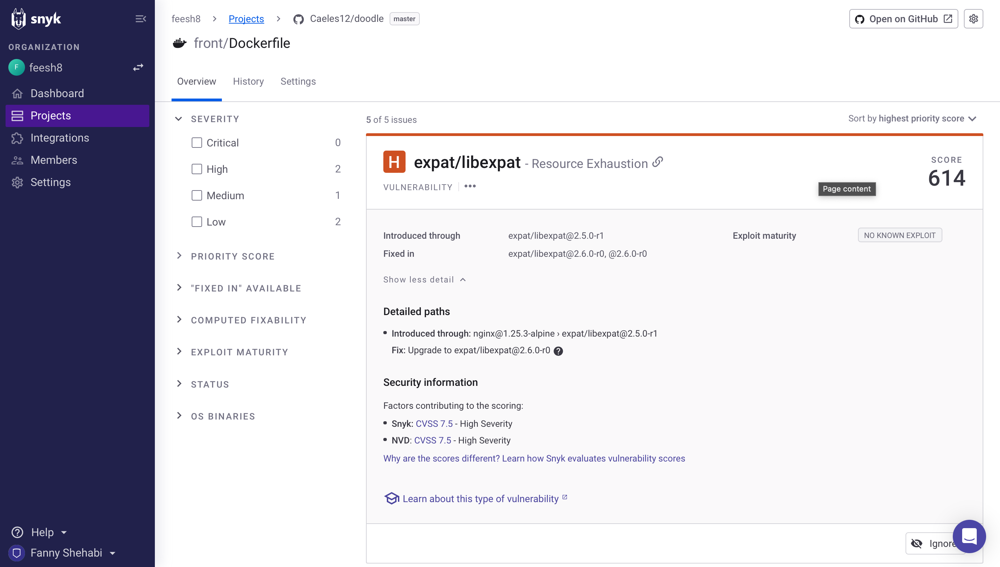

# Tutoriel : Snyk Container

---

## Introduction

Snyk Container est un outil conçu pour aider les équipes DevOps à sécuriser leurs conteneurs tout au long du cycle de vie de développement. Il permet de détecter et de corriger les vulnérabilités dans les images de conteneurs, ainsi que de fournir des recommandations pour améliorer la sécurité. Snyk peut être considéré comme une combinaison de techniques statiques et dynamiques, bien que la majeure partie de l'analyse soit basée sur des méthodes statiques. Ce tutoriel explique les étapes de mise en place de Snyk Container et son utilisation dans les pipelines DevOps.

## Mise en place de Snyk

### Création d'un compte Snyk et import du projet à analyser

Dans un premier temps, il faut se créer un compte Snyk. On peut passer par le lien [suivant](https://snyk.io/fr/product/container-vulnerability-management/?utm_medium=paid-search&utm_source=google&utm_campaign=gs_sn:-brand-ln-french&utm_content=br_ex&utm_term=snyk&gad_source=1&gclid=CjwKCAjwrIixBhBbEiwACEqDJTLjJvBXW1T-IlH6iRA5cVp4S413UrO-ZeFhw0LewDixMSO6TdaXlxoCI5IQAvD_BwE).

Il suffit de descendre en bas de page, jusqu'à la partie "Lancez-vous avec Snyk Container" et de cliquer sur "Démarrer avec GitHub" dans la partie "Gratuit à vie".

On peut ensuite accepter les accès au dépot Git que l'on souhaite scanner. Nous avons ici effectuer ce tuto sur le projet Doodle.

Une fois connecté, il faut accéder au tableau de bord Snyk et importer le projet à scanner.

Nous avons procédé via le site web de Snyk. Il est également possible de mettre en place cet outil par ligne de commande avec une commande du type `snyk container test <nom_image>`.

## Analyse de vunérabilité

Une fois le projet importé, Snyk analyse automatiquement les dépendances des projets, y compris les bibliothèques, les packages et les images de conteneurs, le code, à la recherche de vulnérabilités connues. Les résultats sont alors classés, par fichier et par niveau de sévérité : critique, élevée, moyenne et faible.

On peut alors cliquer sur chaque fichier et voir le détail des vulnérabilités trouvées dans le fichier sélectionné.

On peut alors filtrer les vulnérabilités en fonction de leur sévérité, de leur priorité estimée, etc.

Snyk fournit également des propositions de fix pour une vulnérabilité donnée. Par exemple, ici on comprend que la vulnérabilité est liée à une faille dans la version de `expat/libexpat`. En mettant à jour cette bibliothèque, on règle effectivement ce problème.
Les vulnérabilités sont détaillées. Comme dit précédemment, on sait que la vulnérabilité est liée à une version mais on peut également connaître quel était le problème dans cette version (ici, c'est l'épuisement de ressources).

## Difficultés possibles

L'utilisation de Snyk pour la détection de vulnérabilités dans des projets dockerisés peut être très bénéfique, mais elle peut également présenter quelques défis potentiels. Voici quelques difficultés que l’on pourrait rencontrer lors de l'utilisation de cet outil :

- **Complexité des environnements Docker** : Les projets dockerisés peuvent avoir des configurations complexes, avec de nombreuses dépendances et images de conteneurs. Gérer efficacement ces environnements peut être difficile, en particulier lorsqu'il s'agit de suivre les vulnérabilités à travers plusieurs couches d'images.
- **Intégration avec les pipelines DevOps** : Bien que Snyk offre des intégrations avec divers outils CI/CD et des plateformes de déploiement, l'intégration peut nécessiter des ajustements pour s'adapter aux workflows spécifiques de votre équipe. Configurer correctement l'intégration et interpréter les résultats dans leur context peut être un défi.
- **Gestion des faux positifs et des faux négatifs** : Comme avec tout outil de sécurité, Snyk peut parfois signaler des vulnérabilités qui ne sont pas réellement exploitables (faux positifs) ou ne pas détecter certaines vulnérabilités réelles (faux négatifs). Gérer ces faux résultats peut nécessiter une analyse manuelle supplémentaire.
- **Gestion des correctifs** : Identifier les vulnérabilités est une première étape importante, mais la correction de ces vulnérabilités peut être complexe, en particulier dans les environnements Docker où les dépendances peuvent être imbriquées. Snyk peut recommander des correctifs automatiques pour certaines vulnérabilités, mais d'autres peuvent nécessiter des actions manuelles.

## Conclusion

En conclusion, la mise en place de Snyk pour la détection de vulnérabilités dans un projet dockerisé offre une solution robuste et proactive pour renforcer la sécurité de vos conteneurs et de vos applications. Grâce à son intégration avec les pipelines DevOps et son analyse approfondie des dépendances, Snyk permet aux équipes de développement de détecter et de corriger les vulnérabilités dès le début du processus de développement, réduisant ainsi les risques potentiels pour la sécurité.

Finalement, la sécurité doit intervenir à chaque moment du processus DevOps. Retenons que Snyk n'est qu'un outil parmi tant d'autres et qu'à lui seul, il est insuffisant.

Snyk n'est pas un outil gratuit pour les entreprises et projets plus conséquents.

## Authors

- Noam GEFFROY
- Pol JAOUEN
- Stevan METAYER
- Fanny SHEHABI
